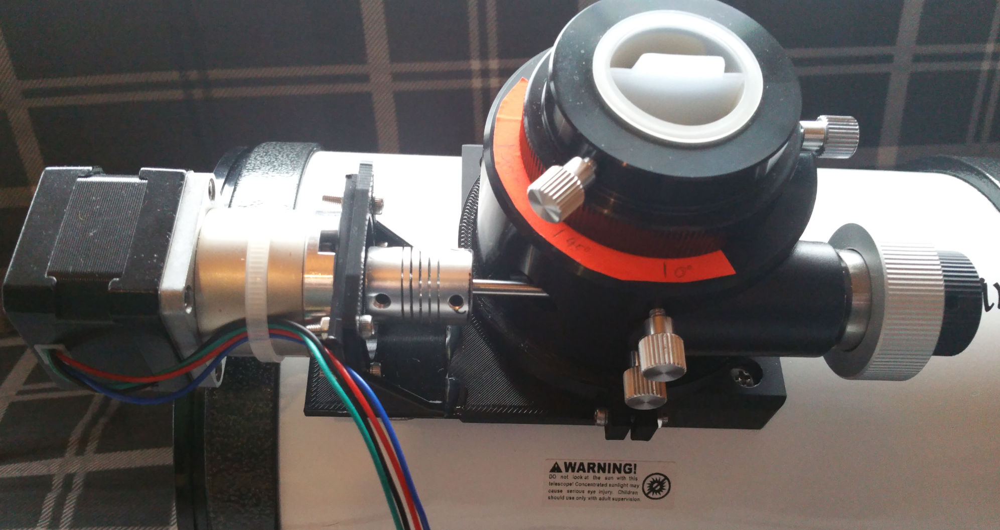

# arduino-motorfocus

Simple moonlite focuser protocol implementation for Arduino and stepper motor.

rewritten with https://github.com/laurb9/StepperDriver

Tested with Arduino Nano, DRV8825 Driver, NEMA17 17HS13-0404S-PG27 Stepper and [INDI / Ekos](http://indilib.org).

STL and blender-project for GSO-Newton mounting in res2/
TODO: Edit the mounting to fit the bigger stepper

Currently I improvised the bigger stepper on the old mounting because I don't want to reprint it.

I use a XL6009 DC-DC StepUp converter to supply the focuser only via the 5V usb wire.

